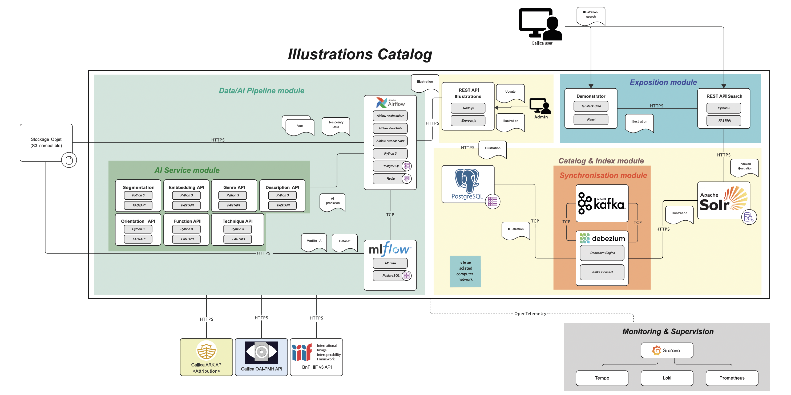
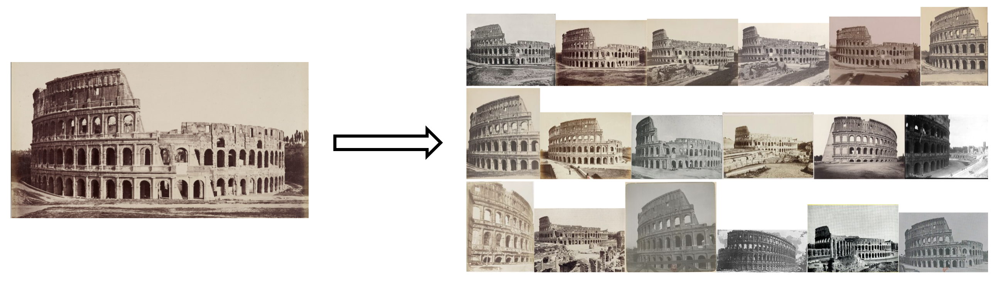
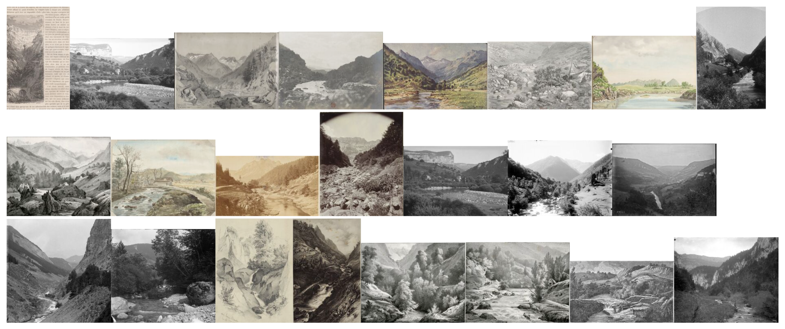
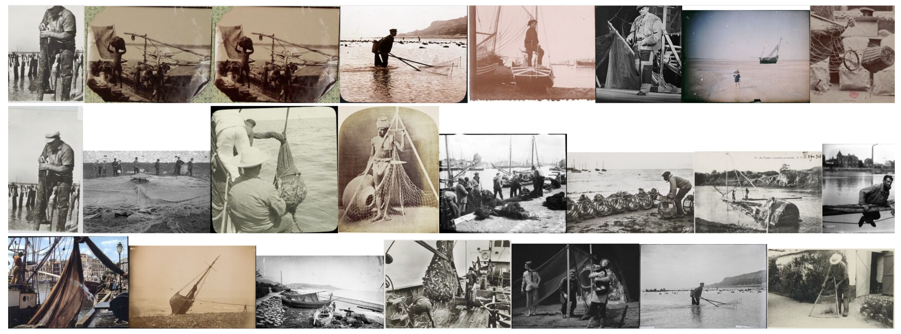

# Gallica Images project (2024-2027)

## Workflow



## Demonstrator (visual embeddings)

### Query = image



### Query = text

```a mountain landscape with a river```



```a poster of a seascape```


### Faceted search

```a fisherman with a net```


```a fisherman with a net``` + ```technique=picture```


